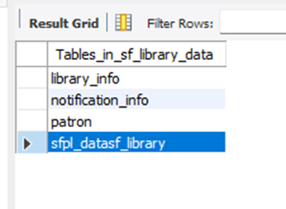
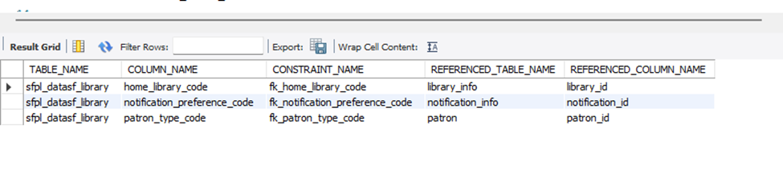
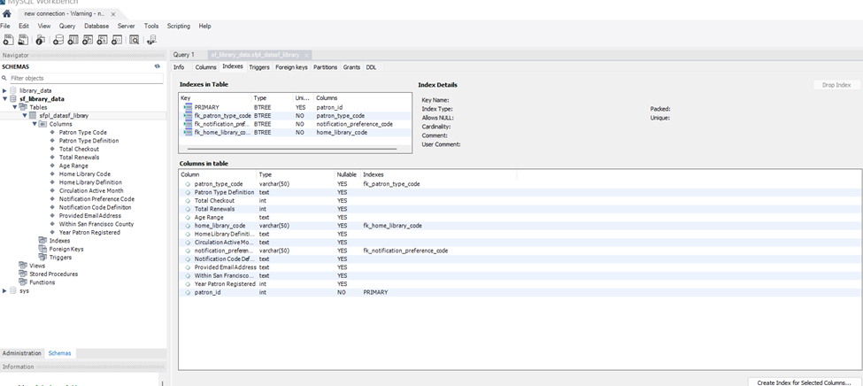

# Project Documentation

---

```markdown
## San Francisco Public Library Data Project

This project transforms a raw Excel dataset from the San Francisco Public Library into a normalized MySQL database with multiple relational tables. It supports efficient querying, data integrity, and future app integration for editing and analysis.

---

## Project Goals

- Normalize a single Excel sheet into multiple meaningful MySQL tables
- Enforce referential integrity using primary and foreign keys
- Enable insights into patron behavior, library usage, and circulation trends
- Build an app interface for updates and edits
- Demonstrate optimal use of MySQL indexing and schema design

---

## Folder Structure

| Folder        | Description |
|---------------|-------------|
| `app/`        | Web interface for interacting with the database (CRUD operations) |
| `docs/`       | Documentation including schema, ER diagrams, and sample queries |
| `mongo/`      | MongoDB experiments for comparison (optional) |
| `results/`    | Visualizations and insights from SQL queries |
| `scripts/`    | Python and SQL scripts for data normalization and import |

---

## Database Schema

The database includes the following normalized tables:

- `sfpl_datasf_library`: Main transactional dataset
- `patron`: Lookup table for patron types
- `library`: Lookup table for library branches
- `notification`: Lookup table for notification preferences

See [`docs/schema.md`](docs/schema.md) for full schema documentation.

---

## Setup Instructions

1. Import the Excel sheet using `scripts/normalize_excel.py`
2. Run `scripts/create_tables.sql` to create the schema
3. Run `scripts/import_data.sql` to populate the tables
4. Launch the app from the `app/` folder (Flask or Node.js)

---

## Sample Queries

- Most active library branches
- Patron types with highest checkouts
- Notification preferences by age group
- Circulation trends by month

See [`docs/queries.md`](docs/queries.md) for examples.

---

## Insights & Analysis

Results are stored in the `results/` folder and include:
- Charts of monthly circulation
- Patron demographics
- Branch performance comparisons

---

## Testing & Validation

- Foreign key constraints enforced
- Duplicate and NULL values cleaned before constraint application
- Indexes added to improve query performance

---

## Notes

- Column names normalized to snake_case
- All foreign keys indexed
- Designed for scalability and app integration

---

## Author

Jennie — 
---

```
## Screenshots



